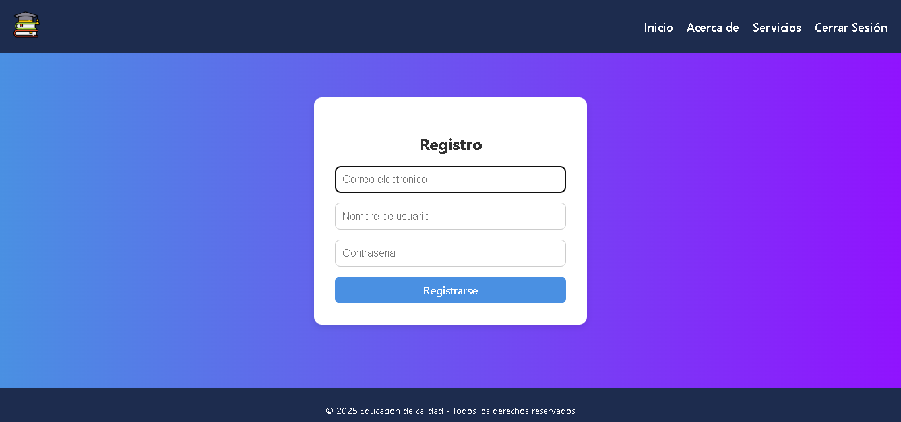
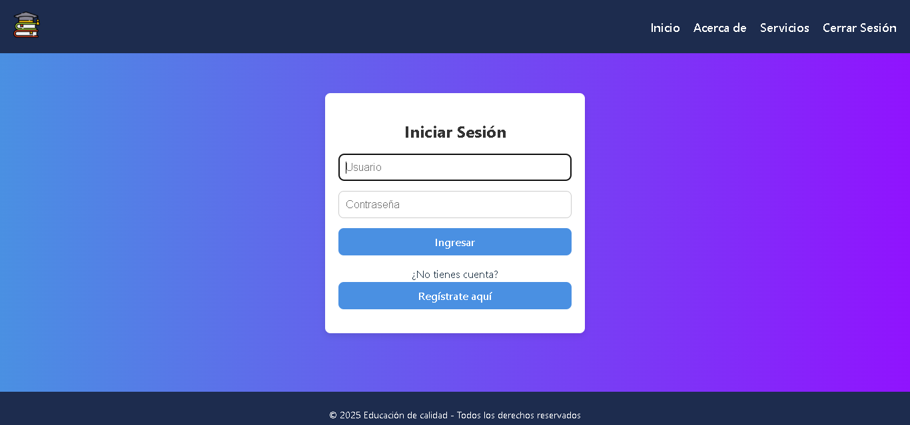
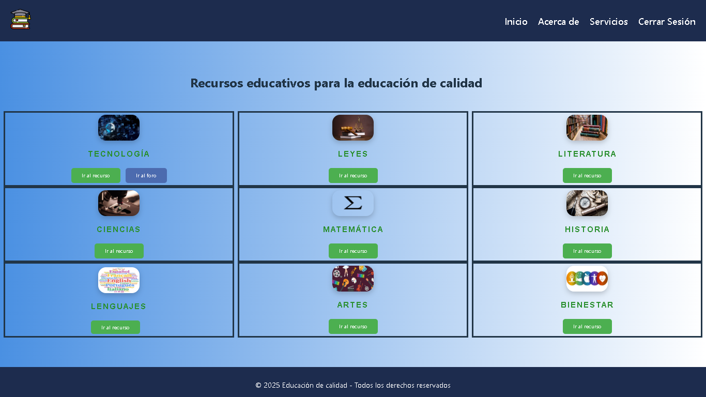
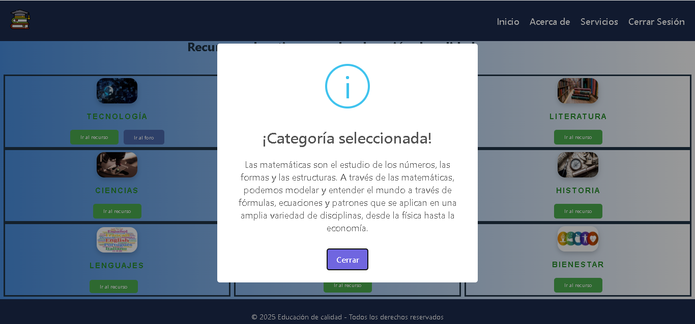
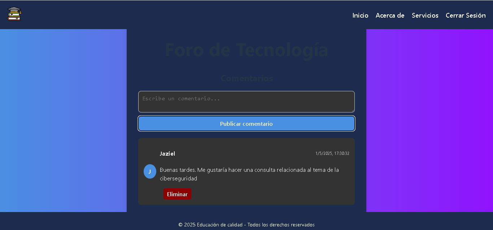

# Educational_repository

# Interactive Educational Platform

An educational platform developed with **Node.js**, **TypeScript**, and **Spring Boot**, allowing users to explore educational resources by category, participate in forums, and access useful information through a modern and functional interface.

## Key Features

- **Category Exploration**: Access various educational resources through interactive buttons.
- **Category Forum**: Each category includes a forum where users can comment and share ideas.
- **User Registration**: New users can create an account to access the platform.
- **Login**: Authentication for registered users.
- **Informative Pop-up**: Displays details and features of each category when clicked.

## Technologies Used

### Backend

- **Spring Boot**: Java framework for building REST services.

### Frontend

- **TypeScript**: Statically typed language for increased robustness.

## Application functionality

